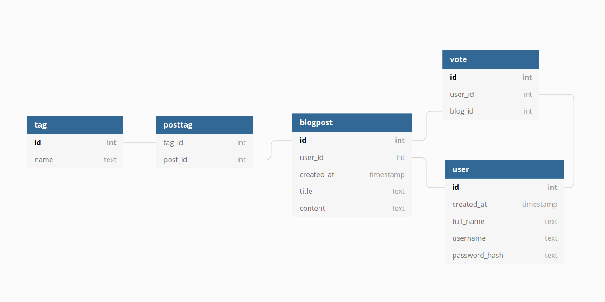

# Tietokantakaavio

## CREATE TABLE -lauseet

~~~~sql
CREATE TABLE account (
        id INTEGER NOT NULL, 
        date_created DATETIME, 
        date_modified DATETIME, 
        full_name VARCHAR(144) NOT NULL, 
        username VARCHAR(144) NOT NULL, 
        password VARCHAR(144) NOT NULL, 
        role VARCHAR(144) NOT NULL, 
        admin BOOLEAN, 
        PRIMARY KEY (id), 
        CHECK (admin IN (0, 1))
);
CREATE TABLE tag (
        id INTEGER NOT NULL, 
        date_created DATETIME, 
        date_modified DATETIME, 
        name VARCHAR(144) NOT NULL, 
        PRIMARY KEY (id)
);
CREATE TABLE post (
        id INTEGER NOT NULL, 
        date_created DATETIME, 
        date_modified DATETIME, 
        title VARCHAR(144) NOT NULL, 
        content VARCHAR(5000) NOT NULL, 
        user_id INTEGER NOT NULL, 
        PRIMARY KEY (id), 
        FOREIGN KEY(user_id) REFERENCES account (id)
);
CREATE TABLE vote (
        id INTEGER NOT NULL, 
        date_created DATETIME, 
        date_modified DATETIME, 
        user_id INTEGER NOT NULL, 
        post_id INTEGER NOT NULL, 
        PRIMARY KEY (id), 
        FOREIGN KEY(user_id) REFERENCES account (id), 
        FOREIGN KEY(post_id) REFERENCES post (id)
);
CREATE TABLE post_tag (
        id INTEGER NOT NULL, 
        date_created DATETIME, 
        date_modified DATETIME, 
        tag_id INTEGER NOT NULL, 
        post_id INTEGER NOT NULL, 
        PRIMARY KEY (id), 
        FOREIGN KEY(tag_id) REFERENCES tag (id), 
        FOREIGN KEY(post_id) REFERENCES post (id)
);
~~~~
